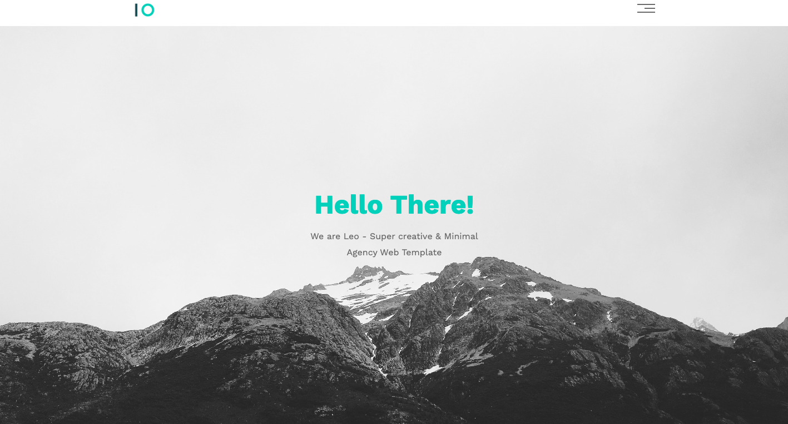

# Leon - Project

## Table of contents

- [Overview](#overview)
  - [Project goal](#project-goal)
  - [Screenshot](#screenshot)
  - [Links](#links)
- [My process](#my-process)
  - [Built with](#built-with)
- [Author](#author)

## Overview

### The challenge

Users should be able to:

- View the optimal layout for the site depending on their device's screen size
- Move to specific section directly from the navbar.

### Screenshot

### Links

- Live Site URL: [Add live site URL here](https://your-live-site-url.com)

## My process

### Built with

- Semantic HTML5 markup
- CSS custom properties
- Flexbox
- CSS Grid
- Mobile-first workflow

## Author

- LinkedIn - [Takeshy](https://www.linkedin.com/in/ahmed-abdelsamie-a1a46a166/)

